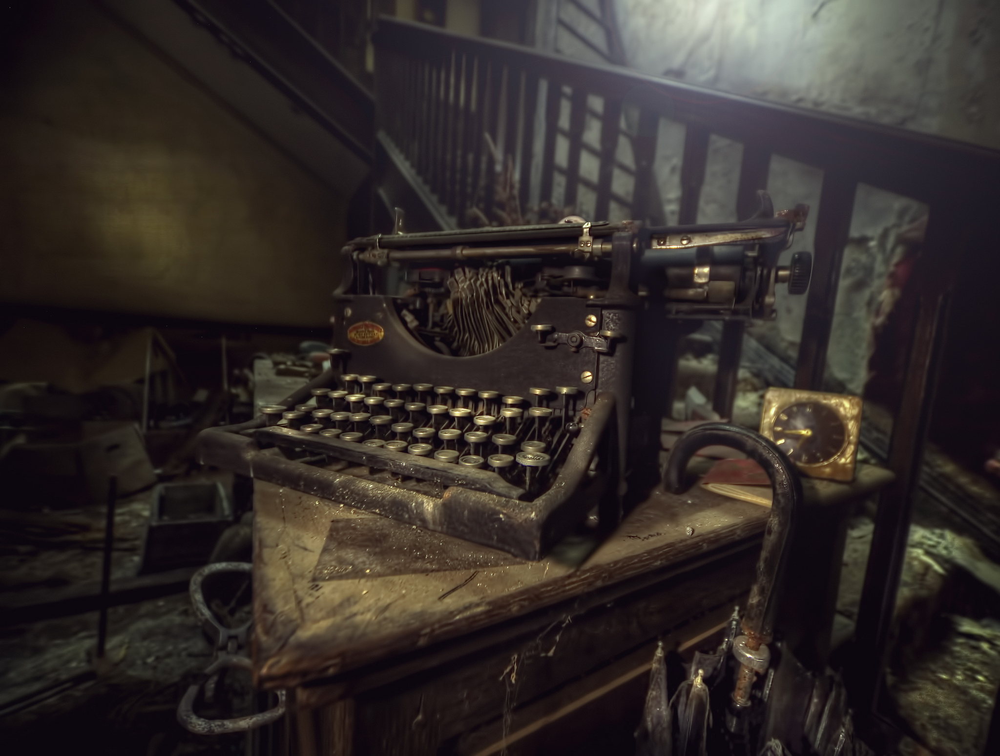
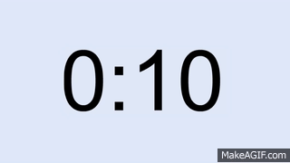
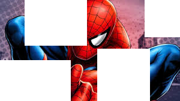
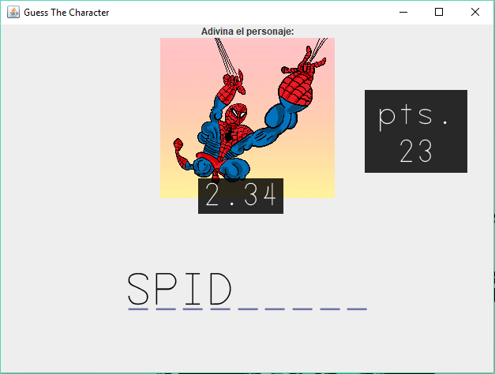
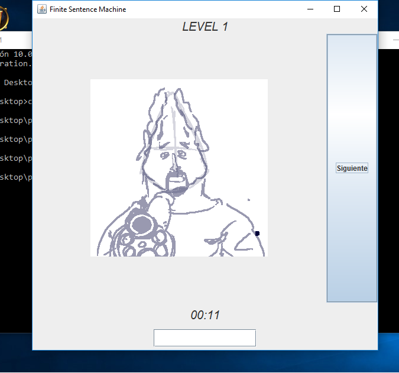

# LA FSM #
**(Finite Sentence Machine)**

## Índice ##

Este documento de diseño se separa en 4 partes principales:
1. Historia
2. Estética
3. Tecnología
4. Mecánicas

## Historia ##

La historia toma lugar en un mundo parecido al presente, excepto por un artefacto ominoso que cae en manos del protagonista: **La maquina de escribir de la muerte**



**La maquina de escribir de la muerte (o Finite Sentence Machine(FSM) en inglés)** es capaz de destruir a cualquier persona con solo saber su nombre y tener su rostro en cuenta mientras escribe el nombre de su víctima. 
El protagonista podría usar esta arma para matar a celebridades, figuras políticas, grandes empresarios, y hasta a la suegra. 
Podría gobernar al mundo a punta de miedo. 
Pero nuestro héroe, que reconoce su poder, la guarda para que no se utilize para el mal.

El protagonista entonces crea muchos enemigos que quieren la **FSM** para ellos, y debe defenderse de todo aquel que quiera su **maquina de escribir de la muerte**. 
Como Costa Rica es un país de paz donde conseguir armas es muy difícil debido a regulacones estrictas, la mayoría de sus adversarios solo portan revolverés y otras armas pequeñas. Adicionalmente la mayoría tiene muy mala puntería y una sóla bala.

## Estética ##

El GUI tendrá una ventanilla con un dibujo(dimensiones 600x600) del enemigo, apuntando directo al jugador listo para disparar. 
Abajo hay otra ventana donde el jugador puede escribir el nombre de su contrincante, antes de que él o ella pueda dispararle.

Justo abajo de la imagen, el cronómetro en cuenta regresiva. Si el cronómetro llega a cero, el enemigo dispara. 

Al costado, los turnos que ha sobrevivido el jugador, cuantificados en puntos.


Las imagenes estarán confinadas en un cuadrado, todas del mismo tamaño. 
Los dibujos serán caricaturescos y exagerados para denotar las características principales de los enemigos. 
De este modo serán más fáciles de reconocer. 
Los dibujos serán hechos por nosotros, ya que todos deben tener una cara amenazadora y un arma en la mano.

## Tecnología ##

La tecnología es el espacio real en el que tenemos la experiencia de juego. En este caso, será el GUI de java en una computadora. 

## Mecánicas ##

1. En este juego el jugador deberá adivinar el nombre del personaje que aparecerá en la pantalla y digitar su nombre lo más rápido posible.
2. El juego pone a aprueba los conocimientos de cultura general, reconocimiento de imagenes y velocidad del jugador. 
3. El juego cuenta con un cronómetro en cuenta regresiva que se reinicia cada vez que la imagen cambie.

4. Si el cronómetro se acaba antes de que el jugador complete la palabra, el enemigo dispara. En lugar de perder/morir inmediatamente, dos cosas pueden suceder:
	* El enemigo en la pantalla "falla el tiro" y el juego sigue al próximo turno.
	* El enemigo logra dispararle al jugador, matándolo y así terminando el juego.

*Los personajes son principalmente de películas y series de TV.*

### No es tan simple ###
Para aumentar la dificultad, algunas imágenes no se presentan completas, se deberá notar que elementos caracterizan al personaje, por ejemplo esta imagen:



### Entrada ###

Para escribir el nombre del personaje se proveera un campo como el siguiente: ```_ _ _ _ _ _ _ _ _```

Para nombres compuestos, la entrada puede tener esta apariencia: ```_ _ _``` ```  _ _ _ _ _ _ _ _```
donde para conseguir digitar el nombre correcto debes digitar el espacio en el campo.

Se usará una fuente monoespaciada que nos beneficia en dos aspectos:

* Ayudará a la estética y al sentimiento de estar usando una máquina de escribir
* Es importante usar una fuente monoespaciadora para poder colocar una imagen en el fondo del espacio de texto indicando la longitud del nombre del enemigo.

### Prototipo ###

Al final del proyecto, se espera que el juego tenga una apariencia similar a la de esta imagen modificada en un editor de imagenes:



### Progreso ###




